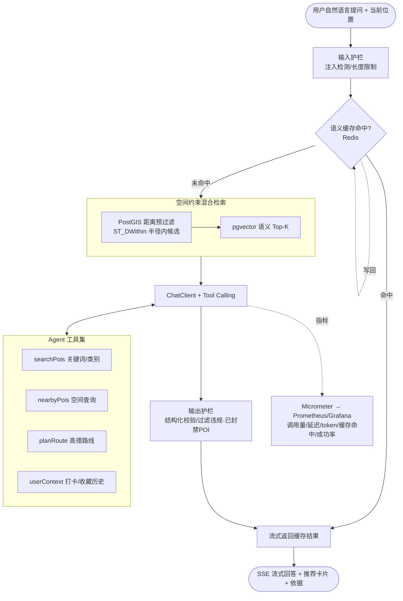

# 地点探索平台 · AI 探索助手实施方案（Spring AI · RAG + Agent）

> 本文档是项目二「地点探索与打卡分享平台」AI 化的**施工蓝图**，后续所有 AI 功能开发均以此为准。
> 制定日期：2026-06-24　·　目标：在已上线的工业级全栈平台之上，落地一个 **Java 原生的对话式 AI 探索助手**，
> 让项目二从「全栈平台」升级为「**AI 原生地点探索平台**」，正面对标 AI 原生 / AI 全栈 / Java+AI 落地类岗位。

---

## 0. 三条铁律（贯穿全文）

1. **真做出来再写简历**：任何指标 / 能力，未实现不写进简历。
2. **有机融合**：AI 能力必须挂在平台已有业务（POI / 打卡 / 评价 / 路线 / 治理）上，复用现有实体与基础设施，不凭空造平行体系。
3. **与项目一差异化**：项目一是 Python/LangGraph 的多 Agent 离线分析系统；项目二走 **Java/Spring AI 的在线对话式应用**，技能维度互补、不重复（详见第 2 节）。

---

## 1. 目标与定位

**做什么**：一个嵌入在地点探索社区里的对话式「探索助手」。用户用自然语言提问（"推荐 3 个地铁能到、适合周末带娃的地方"），助手基于平台 POI + 用户打卡/评价做**地理约束下的混合检索（RAG）**，并通过 **工具调用（Tool Use）** 查 POI / 规划路线 / 查用户历史，**流式**返回带依据的推荐。

**定位升级**：项目二简历定位由「全栈平台」改为「**已上线 AI 原生地点探索平台**」=
已上线产品 + 工业级工程（Outbox/可观测/安全审计）+ **AI 探索助手（Spring AI 的 RAG+Agent+Tool Use，空间约束语义检索，流式/语义缓存/护栏/监控）**。

---

## 2. 与项目一的差异化（关键，决定加分含量）

| 维度 | 项目一（土地遥感 Multi-Agent） | 项目二（本方案 AI 探索助手） |
|---|---|---|
| 生态 | Python / LangGraph | **Java / Spring AI 2.0** ← 打通你的 Java 底子，覆盖 Java 栈 AI 岗 |
| 形态 | 离线/批式多 Agent 分析、报告生成 | **在线、对话式、面向真实用户的低延迟应用** |
| RAG 特色 | 通用文本混合检索 | **空间约束 + 语义检索融合**（PostGIS 距离过滤 → 向量语义排序）地图域独有 |
| 工程重心 | 多 Agent 编排、HITL、自反思 | **生产级在线服务**：流式、语义缓存、成本/延迟、护栏、接现有 Grafana 监控 |

> 一句话卖点：**"LLM/Agent 应用我在 Python(LangGraph) 与 Java(Spring AI) 两套主流生态都落地过，且都做到了生产级。"**

---

## 3. 现状基线（代码核实，改造出发点）

- **后端**：Spring Boot **4.0.3** / Java **21** / JPA + Hibernate Spatial / PostgreSQL(+PostGIS) / Spring Security + JWT / Redis / RabbitMQ；已具备 Prometheus + Grafana 可观测、Outbox、AOP 审计、登录风控（前序工程化升级成果）。
- **前端**：Vue 3 + Vite + Element Plus + Pinia。
- **可作为 RAG 语料的实体**：`POI`(name/category/description/lat/lng)、`POIReview`(评价文本)、`POIShare`(打卡分享文本)、`Tag`。
- **可复用为 Agent 工具的服务**：`POIService`(POI 查询)、`RouteService`(高德路线规划，配 `AmapWebProperties`)、`POICheckInService/POIFavoriteService/POIReviewService`(用户历史→个性化)。
- **现状缺口**：无 pgvector、无任何 LLM/AI 依赖、无对话接口。POI 坐标以 `latitude/longitude`(BigDecimal) 存储，空间过滤需用 PostGIS 由经纬度构造点做 `ST_DWithin`，或经纬度距离公式。

---

## 4. 技术选型与兼容性（务必先验证）

| 组件 | 选型 | 说明 |
|---|---|---|
| AI 框架 | **Spring AI 2.0.x** | 唯一兼容 Spring Boot 4 的线（构建于 Boot 4 + Framework 7，要求 Java 21）。Spring AI 1.x 仅支持 Boot 3.x，**不可用**。GA 约 2026-05；**M0 先锁定可用版本号**。 |
| LLM / Embedding | **DashScope（Qwen）OpenAI 兼容接口** | 复用项目一的 Key 与模型（chat: qwen-plus；embedding: text-embedding-v3，1024 维）。Spring AI 用 OpenAI starter，base-url 指向 DashScope 兼容端点。 |
| 向量库 | **pgvector（加进现有 PostgreSQL）** | 不新增 DB，复用现有库。Spring AI `PgVectorStore`。 |
| 工具调用 | **Spring AI Tool Calling**（`@Tool` 注解 / FunctionCallback） | 把 POIService/RouteService 等封装为工具。 |
| 流式 | ChatClient `.stream()` → 经 `SseEmitter`/`ResponseBodyEmitter` 桥接到 SSE | 注意：项目用 **servlet（webmvc）非 webflux**，Flux→SSE 需桥接（见第 9 节）。 |

> ⚠️ **M0 兼容性验证（开工第一步，不可跳过）**：在分支上引入 Spring AI 2.0 BOM + OpenAI/pgvector starter，跑通 `./mvnw compile` 与一次最小 ChatClient 调用。
> **兜底方案**：若 Spring AI 2.0 与 SB 4.0.3 仍有摩擦，则退为 **Java 直连 DashScope OpenAI 兼容 REST（用 `RestClient`）+ 自写一个轻量 function-calling 循环 + 自写 pgvector 检索 SQL**。该兜底不依赖 Spring AI，反而更显你对 Agent 工具调用原理的掌握；接口/架构设计与本文件一致，仅实现层替换。

---

## 5. 总体架构



---

## 6. 数据与检索设计

### 6.1 语料与向量化
- **语料来源**：`POI`（name + category + description）为主；可选并入该 POI 下的精选 `POIReview` / `POIShare` 文本，提升"体验类"问题召回。
- **向量表**（新增，pgvector）：`poi_embedding(id, poi_id, content TEXT, embedding vector(1024), updated_at)`，对 `poi_id` 唯一、对 `embedding` 建 `ivfflat`/`hnsw` 索引。
- **嵌入管道**：
  - 初始化：批量脚本/启动任务对全量 POI 生成嵌入入库。
  - 增量：POI 新增/描述更新时刷新对应向量（可在 `POIService` 写路径埋点，或定时增量）。
- ⚠️ **ddl-auto 注意**：`vector` 列 Hibernate 不识别，**不要让 JPA 管理向量表**；用独立 SQL（放 `db/migration_ai_pgvector.sql` + `db/init`）建扩展与表，或交给 Spring AI 的 schema 初始化。POI 等业务表不受影响。

### 6.2 空间约束混合检索（差异化核心）
1. **空间预过滤**：由用户当前位置 + 半径（默认 3km，可配），PostGIS `ST_DWithin` 选出候选 POI 集合（基于 lng/lat 构造 `geography` 点）。
2. **语义排序**：在候选集内用 pgvector 对"问题嵌入"做余弦 Top-K（K 默认 10）。
3. （可选）**轻量 rerank** 或按距离/评分加权融合。
4. 组装为上下文（POI 名称/类别/描述/距离/评分），交给 Agent。

> "先地理围栏、再语义排序"是地图域独有的 RAG，与项目一通用 RAG 明确区分。

---

## 7. Agent 工具集（Tool Use / Function Calling）

| 工具 | 复用 | 入参 | 作用 |
|---|---|---|---|
| `searchPois` | POIService | 关键词/类别/中心/半径 | 关键词或类别查 POI |
| `nearbyPois` | PostGIS 查询 | 中心点/半径/类别 | "附近的 X" 空间查询 |
| `planRoute` | RouteService（高德） | 起点/终点/方式 | 路线规划，返回距离/时长/路径 |
| `userContext` | POICheckIn/Favorite/Review | 当前用户 | 取打卡/收藏/评价历史做个性化 |

- 用 Spring AI `@Tool` 暴露；工具入参/出参用结构化 DTO。
- **个性化**：`userContext` 让助手"知道用户去过/喜欢什么"，推荐更贴合——区别于无状态问答。
- （可选加分）**MCP**：把 `searchPois/nearbyPois/planRoute` 也暴露为 MCP Server，呼应项目一的 MCP 主题，体现跨项目掌握。

---

## 8. 生产级能力层（已替你选定：JD 高频 + 与项目一互补，不重复其多 Agent 复杂度）

1. **流式输出（SSE）**：边生成边显示，真实在线产品体验。
2. **语义缓存（Redis）**：对"问题嵌入"做相似度匹配，命中则直接返回，显著降本降延迟。复用现有 Redis。
3. **限流 / 成本预算**：按用户/IP 限流（复用登录风控的限流思路），单次/每日 token 预算上限，防滥用与超支（上线公开必备）。
4. **护栏**：输入侧 Prompt 注入检测 + 长度限制；输出侧结构化校验、**过滤违规/已封禁/已下架 POI**（接平台治理状态）。
5. **可观测**：用 Micrometer 暴露 AI 指标（调用量、p95 延迟、token 消耗、缓存命中率、工具调用成功率），**接入项目二已有的 Prometheus + Grafana**——AI 能力直接上现成看板，极有机。
6. **评测集**：构建 15–20 条问题的小评测，指标=推荐相关性 / 是否落在地理约束内 / 推荐是否有 POI 依据（LLM-as-judge），呼应项目一的评测方法论，作为面试谈资与简历数据来源。

---

## 9. 接口与前端

- **后端**：`POST /api/assistant/chat`（鉴权 `authenticated`），请求体 `{ message, lng, lat, radius? }`；响应 **SSE 流**（token 流 + 末尾结构化推荐卡片）。
  - servlet 栈下：用 `SseEmitter` 消费 `ChatClient.stream()` 的 `Flux<String>`（订阅后逐块 `emitter.send`，完成/异常时 `complete`）。
- **SecurityConfig**：放行规则新增 `requestMatchers("/api/assistant/**").authenticated()`（登录用户可用；如需游客体验可按需 permitAll + 限流）。
- **前端**：在地图/探索页加一个对话入口（浮层或侧栏），消费 SSE 流式渲染；推荐结果点击联动地图打点/路线（复用现有地图组件）。

---

## 10. 配置与安全

```properties
# Spring AI（DashScope OpenAI 兼容）
spring.ai.openai.base-url=${DASHSCOPE_BASE_URL:https://dashscope.aliyuncs.com/compatible-mode}
spring.ai.openai.api-key=${DASHSCOPE_API_KEY:}
spring.ai.openai.chat.options.model=${LLM_MODEL:qwen-plus}
spring.ai.openai.embedding.options.model=${EMBED_MODEL:text-embedding-v3}
# pgvector（复用现有 Postgres 连接）
spring.ai.vectorstore.pgvector.dimensions=1024
spring.ai.vectorstore.pgvector.index-type=hnsw
# 助手参数
app.assistant.retrieval.radius-meters=${ASSISTANT_RADIUS:3000}
app.assistant.retrieval.top-k=${ASSISTANT_TOPK:10}
app.assistant.cache.enabled=${ASSISTANT_CACHE_ENABLED:true}
app.assistant.ratelimit.per-user-per-min=${ASSISTANT_RL:20}
```
- `DASHSCOPE_API_KEY` 走环境变量/`application-local.properties`（gitignore），不入库。
- docker-compose backend 环境变量补 `DASHSCOPE_API_KEY` 等。

---

## 11. 分阶段实施路线（每阶段独立可验收）

| 阶段 | 内容 | 验收 |
|---|---|---|
| **M0 兼容性验证** | 引入 Spring AI 2.0 BOM + OpenAI/pgvector starter；`mvnw compile` 通过；跑通一次最小 ChatClient 调用 | 编译通过 + 能拿到一次模型回复（兜底方案同此验收） |
| **M1 向量库 + 嵌入管道** | pgvector 扩展/表 SQL；全量 POI 嵌入入库；增量刷新 | POI 向量入库，能按问题向量查回相关 POI |
| **M2 空间约束混合检索** | ST_DWithin 预过滤 + pgvector 语义排序融合 | 给定位置+问题，返回"围栏内且语义相关"的候选 |
| **M3 Agent + 工具 + 对话 + 流式** | ChatClient + 4 个 @Tool；`/api/assistant/chat` SSE | 自然语言问→流式回答→正确触发工具→带依据推荐 |
| **M4 生产级层** | 语义缓存 + 限流/预算 + 护栏 + Micrometer 指标接 Grafana | 缓存命中生效；越权/注入被挡；Grafana 看到 AI 指标 |
| **M5 前端对话入口** | 探索页对话浮层 + 流式渲染 + 联动地图 | 端到端可用、可演示（录视频） |
| **M6 评测 + 收尾** | 小评测集跑分；README/文档更新；docker-compose 补 env | 评测有基线数；一键启动含 AI |

**推荐顺序**：M0 → M1 → M2 → M3 → M4 → M5 → M6。M0 是一切前提（先验证兼容性，避免方向性返工）。

---

## 12. 对应 JD 关键词映射（证明每块都在补岗位要求）

| 本方案能力 | 命中的 JD 高频要求 |
|---|---|
| Spring AI / Java 落地 LLM | Java 栈 AI 落地、AI 原生工程师、全栈+AI |
| RAG（pgvector + 空间约束） | RAG、向量数据库、Embedding、混合检索、召回策略 |
| Agent + @Tool 工具调用 | Agent、Tool Use / Function Calling、任务编排 |
| 流式 / 语义缓存 / 限流 / 成本预算 | 流式输出、成本/延迟、语义缓存、P99/SLO |
| 护栏（注入/结构化/内容过滤） | 幻觉与 Prompt 注入工程化应对 |
| Micrometer 接 Grafana | 可观测、全链路追踪、指标监控 |
| 评测集（LLM-as-judge） | Eval、autorater、效果度量 |
| MCP（可选） | MCP / Skills |

---

## 13. 风险与回滚
- **Spring AI 2.0 / SB4 兼容性**（最高）：M0 先验证；不行走兜底（Java 直连）。
- **向量列与 ddl-auto 冲突**：向量表用独立 SQL 管理，不交给 JPA。
- **成本失控**：限流 + token 预算 + 语义缓存三重控制；公开 Demo 默认低配额。
- 所有 AI 能力以**独立模块**接入（`assistant` 包 + 独立配置开关 `app.assistant.enabled`），可一键关闭回退到纯平台，不影响已上线主功能。

---

## 14. 完成后简历文案（项目二升级版，做完再用）

**地点探索 AI 原生平台（已上线）　全栈独立开发**
- 在已上线的工业级全栈社区（Spring Boot 4 + Vue 3，PostGIS 空间能力，Outbox 异步通知 + Prometheus/Grafana 可观测 + 安全审计）之上，落地 **Java/Spring AI 的对话式 AI 探索助手**。
- 自研**空间约束混合 RAG**：PostGIS 距离预过滤 + pgvector 语义检索融合，实现"地理围栏内的语义推荐"。
- 基于 Spring AI **Tool Use** 编排 POI 搜索 / 路线规划 / 空间查询 / 用户历史四类工具，结合打卡收藏历史做个性化推荐。
- 生产级落地：**SSE 流式输出 + 语义缓存 + 限流/Token 预算 + Prompt 注入护栏**，AI 调用指标接入 Grafana 监控；自建评测集量化推荐质量。
> 数字（缓存命中率/p95 延迟/评测相关性等）做完后据实填入。

---

## 15. 明确不做（避免过度设计）
- 不做多 Agent 复杂编排（那是项目一的定位，重复无益）。
- 不自训/微调模型（应用岗非必需，时间黑洞）。
- 不引入新向量数据库（pgvector 复用现有 Postgres 足矣）。
- 不做多模态（当前无必要）。
